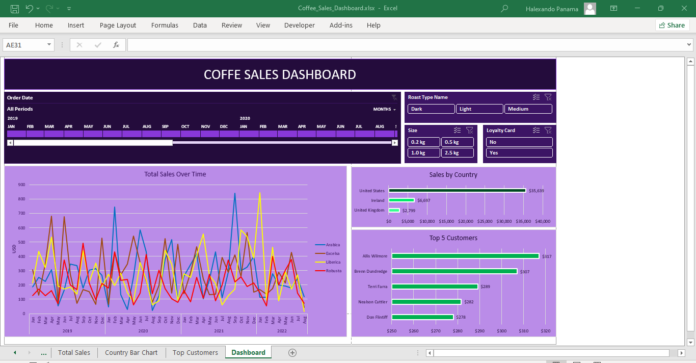

# ☕ Coffee Sales Interactive Dashboard (Excel)

An interactive Microsoft Excel dashboard analyzing historical coffee bean sales data across multiple countries, customer segments, and product lines. This project transforms raw relational data into actionable business insights on sales trends, top-performing products, and key customer groups using advanced Excel formulas and dynamic visuals.

---

## 📊 Dashboard Preview


*(Replace `dashboard_preview.png` with the screenshot file of your final dashboard saved in this repository)*

---

## 🎯 Key Business Questions Answered

* **Sales Trends over Time:** How do sales fluctuate across coffee types (*Arabica, Robusta, Excelsa, Liberica*) from month to month?
* **Geographic Distribution:** Which countries (*United States, Ireland, United Kingdom*) drive the highest revenue?
* **Top Customers:** Who are the top 5 revenue-generating customers?
* **Customer Behavior:** How do purchasing patterns differ based on package size, roast type, or membership in the loyalty card program?

---

## 🛠️ Technical Steps & Excel Functions Used

1. **Data Gathering & Lookups:**
   * Combined data across three relational tables (*Orders, Customers, Products*).
   * Used **`XLOOKUP`** to fetch customer details and loyalty card status.
   * Used dynamic **`INDEX & MATCH`** formulas to populate coffee product specifications (roast, size, unit price).
   * Applied nested **`IF`** logic to expand abbreviated names (*e.g., "ARA" to "Arabica"*) for clearer reporting.

2. **Data Cleaning & Formatting:**
   * Checked and removed duplicate records.
   * Standardized date formats (*DD-MMM-YYYY*) and applied custom number formatting (*e.g., currency in USD, package weight in kg*).
   * Converted raw datasets into formal **Excel Tables** to enable automated updates for future data.

3. **Analysis & Dashboard Building:**
   * Built **Pivot Tables** and **Pivot Charts** (Line Chart for trends over time, Bar Charts for geographic and top customer performance).
   * Added interactive controls: **Timeline Slicer** (date filtering) and **Slicers** (Roast Type, Size, Loyalty Card).
   * Linked slicers across all charts using **Report Connections** for seamless, synchronized filtering.

---

## 📁 Repository Structure

```text
├── Coffee_Sales_Dashboard.xlsx   # Main Excel file with raw data, pivot tables, and interactive dashboard
├── dashboard_preview.png          # Screenshot image of the final dashboard
└── README.md                      # Project documentation